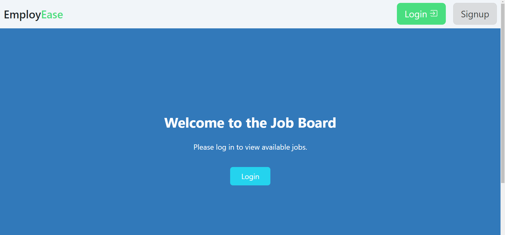
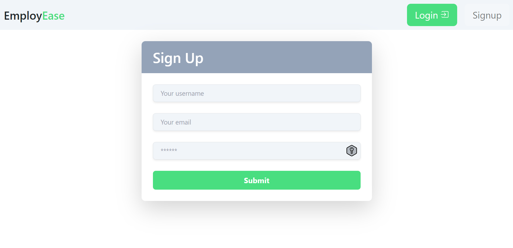
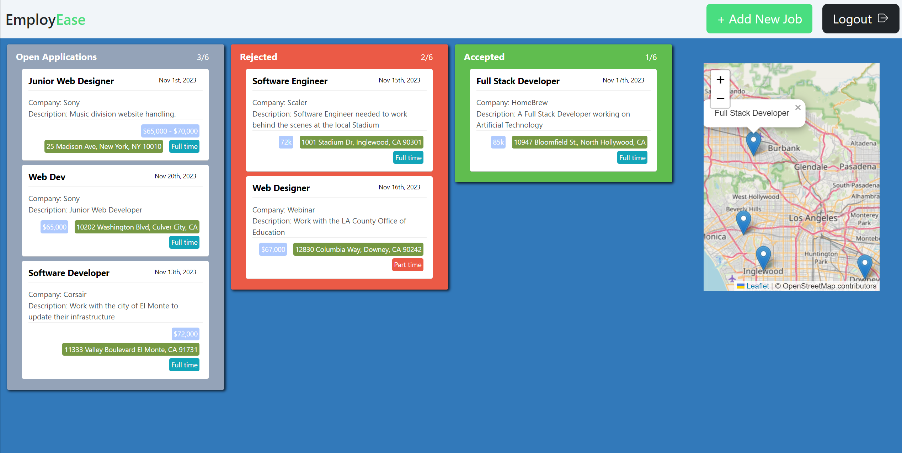
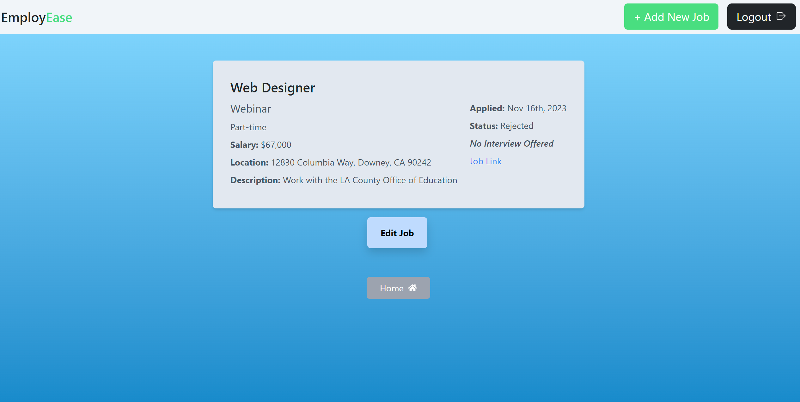
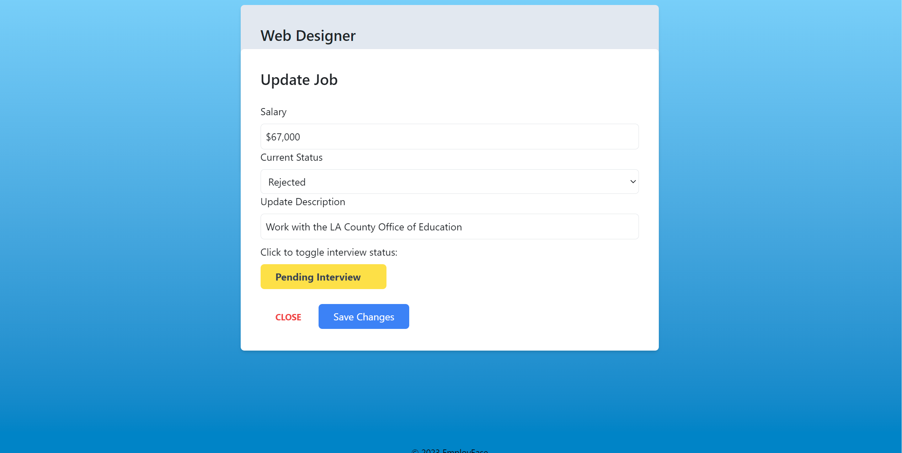
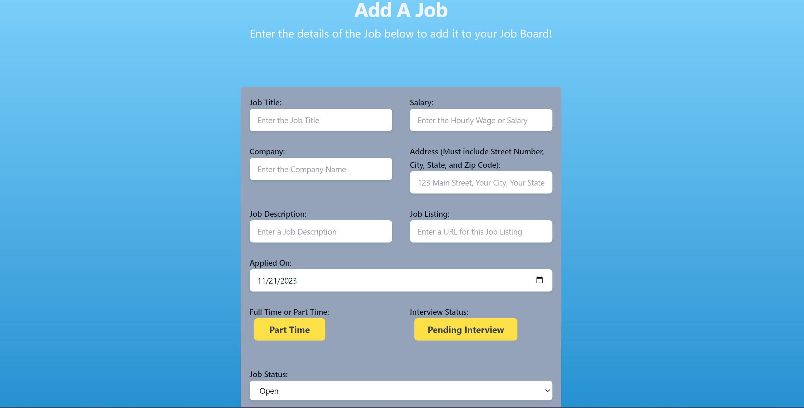
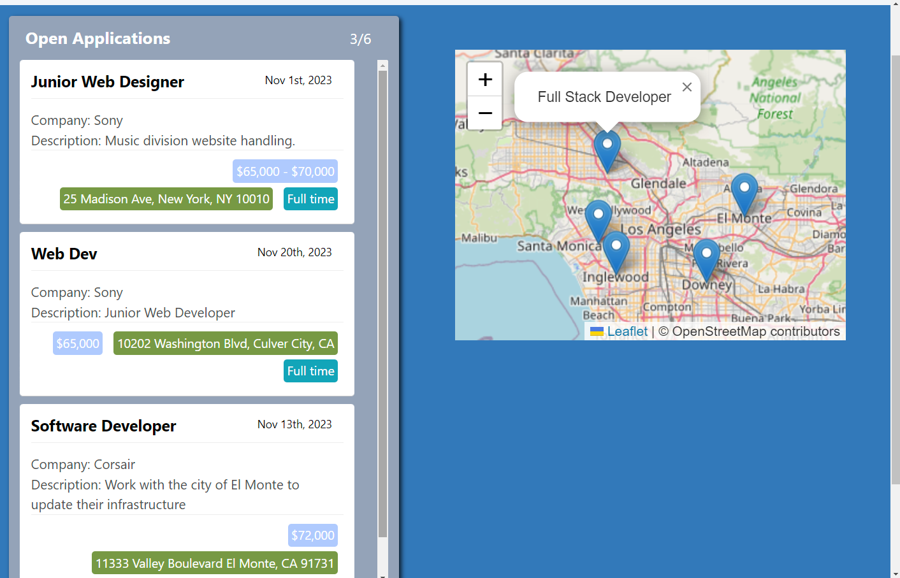
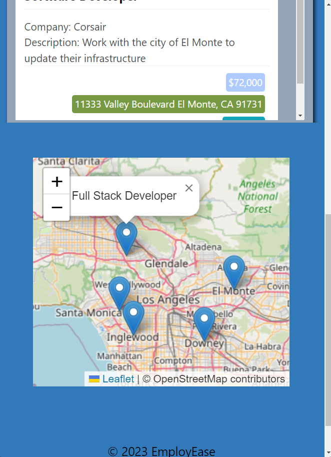

# EmployEase

## Description

This project is an exemplary demonstration of what we have learned over the past few months. As new students to the UCLA Extension Full Stack Development Bootcamp, we started with little, if any, working experience with coding. From those humble beginnings we present to you today the pinnacle of our hard work over these last few months, EmployEase! This application/website is a practical and effective tool to help new graduates from all walks of life find careers in our respective chosen fields. EmployEase will help us in that effort by effortlessly sorting our job applications into easily manageable and sleek looking tiles that we can sort with the greatest of ease.

When it comes to finding a job, the process in itself can be tough if not a downright slog-fest. Easily keeping track of places you have applied to, whether or not you have a pending interview, or salary or location requirements used to require quite the coordinated effort and perhaps a large corkboard with lots of string of varying colors. Now, you can keep track of all that effortlessly and so much more. With a simple swipe of a mouse click, you can move prospective jobs or applications into several categories which can tell you at a glance how your current prospects look. You can quickly reference the location of your future employer with a quick glance to the right and estimate if the potential commute is a leverage point when negotiating salary. 

Speaking of salary, when you click on the Add Job button, you are whisked away to a new page where you can enter any and all defining criteria, factors which are important in your decision-making process, and allow you to quickly reference important information about the jobs you applied for. Simply click the Add Job button to add it to your collection! A new helpful pin will appear on your map which corresponds with the new job you just created! 

Perhaps you are in a few rounds of interviews and decide that the company can afford to pay you more, or perhaps you are more qualified for a more senior role than the one you applied for. Simply click on the job in order to update and edit it! You are the master of your destiny and EmployEase will help ensure you have everything you need at your fingertips in your job hunt.

EmployEase was a great way to gain knowledge about a variety of coding subjects. We once again used a MERN Full Stack and sharpened our skills when it came to using models, schemas, typeDefs and resolvers. That reinforced learning ensures that we will be able to go forth and dazzle future employers with our back-end server skills. We also improved upon and honed our front-end development as well with our React coding, utilizing Components to carry through common threads in their respective pages. We used Queries and Mutations to summon data and manipulate it to fit the categories we deemed most important.

We learned new skills as well with this particular project. We incorporated a Trello board with react-trello and learned the ins-and-outs of mastering the board and its cards, creating and updating data via mutations in real time as the cards move across their respective lanes, which in turn updates the data in real time and is reflected when visiting other pages like the update job page. We would also like to draw attention to the corresponding map which can be seen on the right side of the home page. This map was created using Leaflet.js and updated with OpenStreetMaps. Whats special about this particular map is that it updates in real time with the location unique to each user and will display the job title on a location pin, the goal being that you can quickly scan the map and in doing so, that information will help you make a better informed decision if two offers are close in competition. As the old saying goes, "Its all about Location, Location, Location...". EmployEase strives to make your job application and interview process as painless and effortless as possible. If you aren't wasting time on book-keeping and tracking applications and whether or not you have an interview, that saves you more time for interview preparation, researching companies or job titles you might want to have, and salary negotiation. Get the most out of your job hunt and focus on the important aspects, leave the rest to EmployEase!

## Table of Contents

[Installation](#installation)

[Usage](#usage)

[Features](#features)

[Credits](#credits)

[License](#license)

## Installation

## Usage
The first step to using our program is to sign up on our login page and create a username and password to access the homepage.

After Signing up and logging in, you will presented with your custom homepage filled with the various jobs you have applied for in a quick and easy to read display!

You can drag and drop the cards from one section (Open Applications, Rejected, Accepted ) to another as the situation changes. You can also click on any of the job cards to get a clearer view of what the job offers you.

You will notice a button at the bottom that will allow you to edit your currently viewed job and open an update form if you have renegotiated your salary or your job title!

Back on the homepage, in the upper right hand corner is a bright green button reading "Add New Job". If you click on it, you will be taken to a new page where you can enter all the important distinguishing criteria you hold important in your job search.

Clicking on the Add Job button at the bottom updates your cards and allows you to easily glance at them. You can also look at the map and see where jobs are located in reference to how much you may have to commute from your home.

 

We also offer a responsive design for those go-getters on the move! Even if you are travelling from one interview to the next, EmployEase can keep up with you on your tablet!

Or on your phone/mobile device!

We scale with your needs, and we are where you need us, when you need us!

## Features

## Credits

## License

